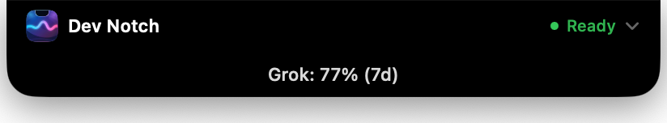
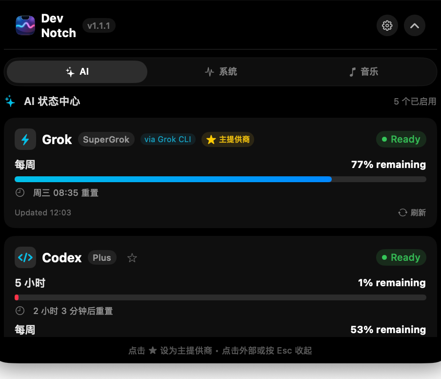
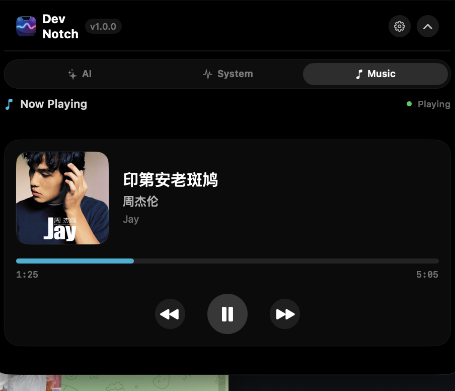
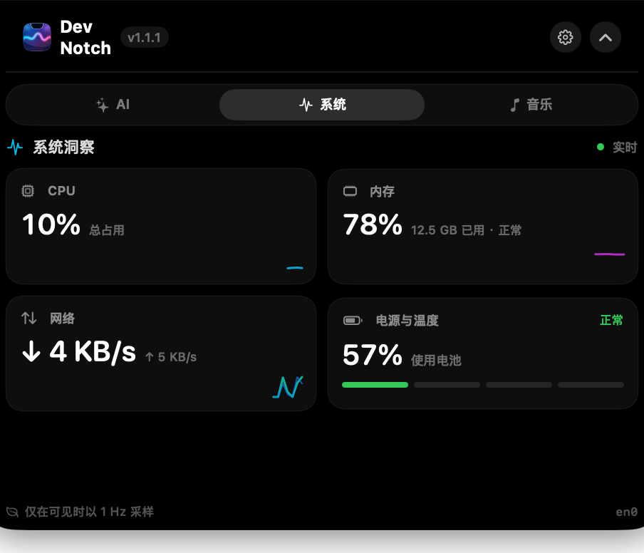
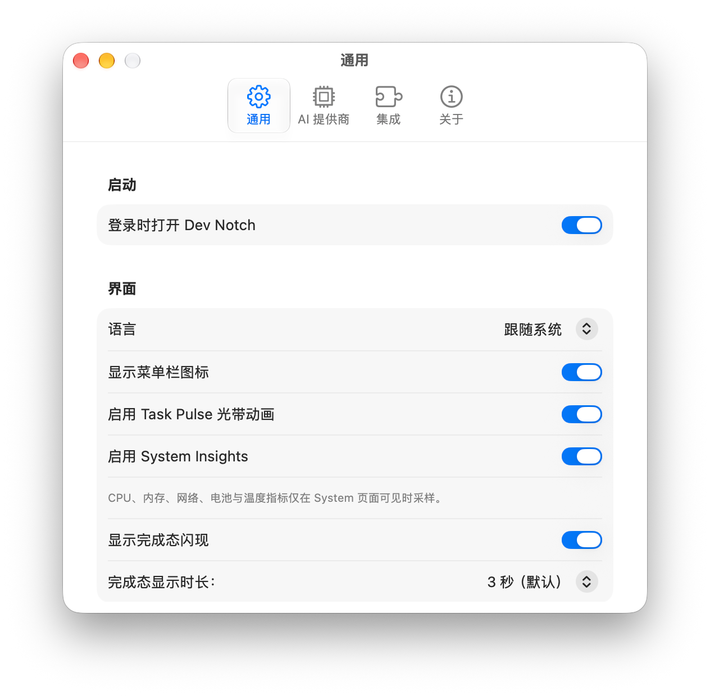
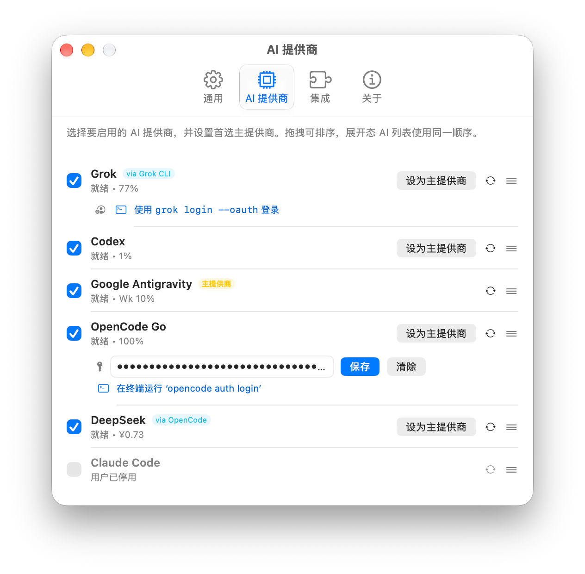

# Dev Notch

**Dev Notch** 是专为 macOS 设计的原生「AI Developer Dynamic Island」桌面应用。它巧妙利用 MacBook 的物理刘海区域（并在无刘海屏幕上自适应为顶部虚拟岛），为开发者提供沉浸、轻量且无打扰的 AI 运行状态、额度用量、实时任务流式光环（Task Pulse）、系统 Now Playing 与快捷控制中心。

## 截图

收起态（不再挡住刘海右侧菜单栏图标）：



展开态 AI / Music / System：







设置 · 通用 / AI 提供商：






## 📌 当前开发阶段

- **Phase 1：原生刘海窗口底座与三态交互（已完成）**
- **Phase 2：AI Provider 架构与 Codex Provider 真实接入（已完成）**
- **Phase 3：Multi-Provider 统一架构与 OpenCode Go 接入（已完成）**
- **Phase 4：DeepSeek 真实余额接入与 Generic Provider Metrics 架构升级（已完成）**
- **Phase 5：Claude Code Provider 接入与 Live Activity 桥接（已完成）**
- **Phase 6：Google Antigravity Provider + Generic AI Activity + Task Pulse（已完成）**
- **Phase 7：系统全局快捷键 + 菜单栏状态图标 + 原生设置面板 + 自启动（已完成）**
- **Phase 8：v0.9.0-rc1 发行候选审计、Bundle Helper、Hardened Runtime（已完成）**
- **Phase 9：v1.0.0 GitHub Direct Distribution 正式发行（已完成）**
- **Phase 10：System Insights 公共指标与 AI / System 内容路由（已完成）**
- **Phase 11：Grok 配额、Now Playing、刘海点透与 Provider 拖拽排序（已完成）**
- **Phase 12：应用内语言（跟随系统 / English / 简体中文）（已完成）**

## Requirements

- macOS 14 or later
- Apple Silicon Mac; the notch interface also adapts to supported displays without a physical notch

## Installing Dev Notch

1. Download `DevNotch-1.1.2.dmg` from GitHub Releases.
2. Open the DMG.
3. Drag `Dev Notch` (`DevNotch.app`) into `/Applications` (or `~/Applications`).
4. Open Dev Notch from Applications.

### macOS Security Notice

Dev Notch is currently distributed directly through GitHub and is not signed with an Apple Developer ID or notarized by Apple.

When opening Dev Notch for the first time, macOS may display a notice stating that the developer cannot be verified. This is expected for direct GitHub distributions without Apple Developer Program membership.

To allow Dev Notch to run (recommended standard macOS flow):
1. Attempt to open Dev Notch. If macOS displays a verification alert, click **Done** (or **Cancel**).
2. Open **System Settings** -> **Privacy & Security**.
3. Scroll down to the **Security** section where you will see: *"DevNotch was blocked from use because it is not from an identified developer"*.
4. Click **Open Anyway** (仍要打开) and confirm with your macOS user password / Touch ID.
5. Click **Open** when prompted.

This authorization is normally required only once for the first launch.

> **Security note**: We do **not** recommend disabling Gatekeeper globally (`sudo spctl --master-disable`), as doing so reduces your Mac's overall system security. Use the standard macOS System Settings authorization flow above.

### Advanced Terminal Troubleshooting (Optional)

For power users familiar with Terminal, if macOS quarantine prevents launching after copying to `/Applications`:
```bash
xattr -d com.apple.quarantine /Applications/DevNotch.app
```
*(Note: System Settings -> Privacy & Security -> Open Anyway remains the recommended primary method for all users.)*

### Integration Prerequisites

Dev Notch must be moved to `/Applications` or `~/Applications` before enabling Claude Integration, Google Antigravity Integration, or Launch at Login. While Dev Notch can run directly inside a DMG or Downloads folder for temporary inspection, persistent CLI hook integrations and background services intentionally require a stable Applications directory path to avoid pointing hooks to ephemeral volumes.
---

## 🛠 技术栈

- **开发语言**：100% Swift 5.9+ / Swift 6 现代并发规范（Actor 隔离、Sendable 检查）
- **UI 框架**：SwiftUI（含原生 `Settings` 场景与多标签设置页）
- **窗口系统**：AppKit（`NSPanel` + `NSStatusItem` + `NSWindowController`）
- **系统底层桥接**：Apple 原生 `Carbon.HIToolbox` 全局快捷键（**0 隐私权限**，无需 Accessibility 或 Input Monitoring）
- **系统指标**：Mach CPU/VM、SystemConfiguration 主网络接口、IOKit Power Sources、Foundation Thermal State（无新增隐私权限）
- **自启动服务**：Apple 原生现代 `ServiceManagement.SMAppService`（macOS 14+）
- **跨进程桥接**：100% Swift 原生编译的独立 CLI 桥接工具（`DevNotchActivityBridge` / `DevNotchClaudeBridge`，无 Node/Python/jq 依赖）
- **构建与测试**：`xcodegen` + `xcodebuild` + `XCTest`
- **目标平台**：macOS 14.0+ (Sonoma / Sequoia)
- **适配架构**：Apple Silicon (arm64) 原生支持
- **设计哲学**：0 第三方运行时框架，纯正 macOS 原生手感，Local-First 安全隐私设计

---

## 🚀 如何 Build & Run & Test

### 编译并启动应用
```bash
./script/build_and_run.sh
```

### 运行完整自动化测试套件
```bash
DEVELOPER_DIR=/Applications/Xcode.app/Contents/Developer xcodebuild \
  -project DevNotch.xcodeproj \
  -scheme DevNotch \
  -destination 'platform=macOS' \
  test
```

## 📄 License

MIT — 见 [LICENSE](LICENSE)。项目为 100% 原创实现，无第三方代码引入，故无需第三方 notices 文件。


---

## ✨ 核心架构与功能

### 1. 完整产品形态与系统级能力 (Phase 7)
- **零权限原生全局快捷键 (Global Hotkey)**：
  - 基于 Apple 系统底层 `Carbon.RegisterEventHotKey` 实现，**无需申请辅助功能 (Accessibility) 权限，无需申请输入监控 (Input Monitoring) 权限**。
  - 默认全局快捷键：`⌃⌥Space`（Control + Option + 空格键），可从任意 App（Finder、终端、浏览器）一键呼出展开刘海看板，再次按下折叠。
  - 展开态支持按 `Esc` 键快速收回。
  - 内置 `ShortcutRecorderView` 快捷键录制组件，严禁无修饰键（单字母/单空格）注册，防止输入误拦截。
- **原生菜单栏状态图标 (Menu Bar Status Item)**：
  - 基于 `NSStatusItem` 呈现模板图标，深浅色模式自适应。
  - 动态呈现所有已启用 Provider 的简明状态与用量摘要（数据严格来自内存快照，无异步阻塞 I/O）。
  - 支持快捷展开刘海（Open Dev Notch）、一键全量刷新（Refresh All）、设置（Settings…）与退出（Quit）。
  - 用户可在设置中一键开启或关闭菜单栏图标。
- **原生多标签设置窗口 (Settings Scene)**：
  - 基于 SwiftUI `Settings` 场景构建，分为 **General**、**AI Providers**、**Integrations**、**About** 四大标签页。
  - 解决 `LSUIElement = true` 辅窗应用激活前台获得键盘焦点的问题，关闭设置后自动回归无 Dock 栏辅助工具形态。
  - **开机自启动**：接入系统原生 `SMAppService.mainApp`，与系统“登录项”安全同步，不使用旧版 LaunchAgent 脚本 hack。
  - **Provider 启闭控制**：用户可自由勾选启用/禁用特定提供商，禁用后不启动子进程、不发起轮询、自动将 Primary 运行时回退至健康就绪的 Provider。
- **Antigravity CLI 官方 Hook 真实端到端验证通过**：
  - 真实 `agy` CLI 执行 -> 触发官方 `~/.gemini/config/hooks.json` 钩子 -> 调用 `DevNotchActivityBridge` -> 写入原子快照 -> 驱动 Dev Notch 状态流转（working -> completed）实测 100% 成功。

### 2. Task Pulse 任务流式光环 (Phase 6)
- **克制优雅的原生微光带 (`TaskPulseView`)**：
  - 位于刘海底部曲面边缘的 1.5pt 动态光带，不破坏窗口几何尺寸，不截获鼠标点击。
  - **Working 态**：青蓝微弱渐变呼吸微光（`opacity: 0.35` ~ `0.95`）。
  - **Approval 态**：稳定常亮的橙色警示光。
  - **Completed 态**：绿色完成瞬态高亮（1.2 秒后淡出）。
  - **辅助功能兼容**：严格遵循 macOS `Reduce Motion` 减弱动态效果设置，开启时自动关闭连续动画，改为静态常亮微光。


### 3. System Insights & Music (Phase 10–11)
- **AI / System / Music 内容路由**：展开态三页签；默认仍为 AI 首页。
- **公开原生指标**：CPU 总占用、内存占用与压力、主网络接口上下行、电池及系统 Thermal State。
- **低能耗采样**：仅 System 页面可见时以 1 Hz 采样；离开页面立即停止，不维持后台轮询。
- **60 秒趋势图**：固定容量环形历史缓冲，避免每次采样搬移数组；CPU、内存、网络使用轻量 sparkline。
- **Now Playing**：系统正在播放（含向控制中心上报的自定义播放器）；悬停仅在真正播放时显示歌名，暂停回到 AI 配额。
- **明确边界**：不读取私有 IOReport/SMC，不展示不稳定的 GPU 占用或精确温度。

### 4. 多 AI 厂商真实接入现状

| 提供商 | 认证模式 | 核心度量 / 能力 | 本机验证状态 |
| :--- | :--- | :--- | :--- |
| **OpenAI Codex** | ChatGPT OAuth | 5h 滚动额度、Weekly 配额 | 官方 App-Server 进程与配额全链路已验证；卡片支持一键 `codex login` |
| **DeepSeek** | API Key (via OpenCode) | 账户余额、充值金/赠金细项 | 官方 API `GET /user/balance` 实时验证通过 |
| **Google Antigravity** | Google Account OAuth | CLI 探测、官方 Hooks | 本机 CLI 与真实 Hooks 验证通过；配额接口未公开 |
| **Anthropic Claude Code** | 官方 CLI | 上下文占用、活动钩子桥接、Task Pulse | 卡片支持一键 `claude auth login`；订阅配额无公开接口 |
| **OpenCode Go** | 本地 CLI | 多窗口模型自适应 (5h/Weekly/Monthly) | 本机 CLI 探测通过 |
| **xAI Grok** | `grok login` OIDC | SuperGrok 周额度 (`cli-chat-proxy` credits) | 本机 CLI + 配额接口已验证 |

设置中可拖拽排序 Provider，展开 AI 列表使用同一顺序。收起态刘海不再挡住右侧菜单栏图标。

“已接入”表示产品代码路径存在；“实测通过”仅表示列出的本机验证已完成。

---

## 🔒 安全与隐私承诺

- **No credential leakage was observed in the implemented tests and log inspection.**
- **AI Activity only processes local session metadata, strictly excluding prompts, responses, tool inputs, and source code content.**
- **Global Hotkey uses native Carbon event tables, requiring ZERO Accessibility or Input Monitoring permissions.**
- 应用程序始终坚持 Local-First，无任何远程遥测或私密数据留存。

---

## 🧪 自动化测试套件

内置全面的单元与集成回归测试，包括：
- `PreferencesStoreTests`：默认值、Primary 迁移、System Insights 与 Provider 启闭等偏好持久化、瞬态完成时长配置。
- `SystemMetricsTests`：CPU tick 差分与计数器回绕、网络速率/重置、固定容量历史顺序。
- `KeyboardShortcutTests`：按键序列化、快捷键字符格式化、非法无修饰键拦截、Carbon 标志位双向映射。
- `GlobalHotKeyTests`：快捷键双向切换折叠/展开、注册失败优雅处理、注销生命周期。
- `LaunchAtLoginTests`：自启动状态抽象、系统注册异常捕获。
- `StatusItemMenuTests`：零 I/O 菜单快照生成、菜单栏图标显隐响应。
- `TaskPulseTests`：工作态光环、减弱动态效果、双工作态隔离。
- `AntigravityDiscoveryTests` & `AntigravityIntegrationTests` & `AntigravityActivityTests`：CLI 探测、真实钩子结构、脱敏审计、原子 IPC。
- `ClaudeParsingTests` & `ClaudeIntegrationTests` & `ClaudeActivityTests`：CLI 认证模式、钩子合并、45s 超时看门狗。
- `DeepSeekParsingTests` & `DeepSeekClientTests` & `DeepSeekCredentialTests`：官方余额 API 与 MockURLProtocol 状态码验证。
- `GrokAuthTests`：`~/.grok/auth.json` 会话解析与 credits JSON。
- `NowPlayingTests`：系统 Now Playing 字段解析与进度推算。
- `AIProviderManagerTests`：多厂商并行调度、Primary 持久化、排序、容灾回退、超时与异常隔离。
- `AIUsageWindowTests` & `GenericMetricsTests` & `CodexParsingTests` & `OpenCodeParsingTests`。
